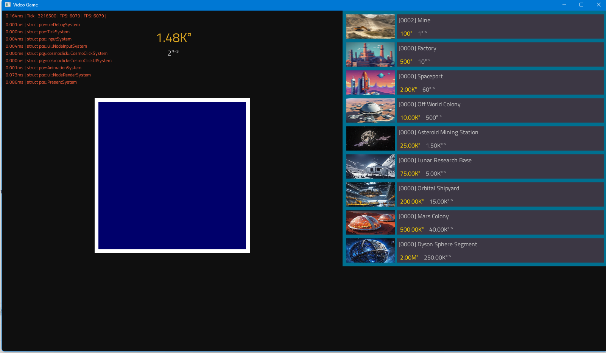

# Installation
1. Install libfreetype with MINGW64 and add its path to environment.  
On my Windows machine it's `C:\msys64\mingw64\bin` `C:\msys64\mingw64\include`
2. Run CMAKE it copies the DLL's into the build directory 

## Problem
freetyped.dll not found. idk, found this post that says we need to not use relative path. idk why but i set the aboslute path once and then turned it back to relative and it worked


```aiignore
    char* font_path_absolute = "C:\\Active\\CPP\\pcg\\resources\\font.ttf"; // working
    char* font_path = "../resources/font.ttf"; // fail
```

Also `Could NOT find Freetype (missing: FREETYPE_INCLUDE_DIRS)`
its because you have to add environment `C:\msys64\mingw64\include`
try adding the libfreetype 6 dll

clicking the file can also cause error this works fine if running from mingw
# WSL
```
install ninja-build  
install libfreetype6-dev
```

# VCPKG ZLIP BROKEN
`CMake Error at C:/Users/[user]/.vcpkg-clion/vcpkg/installed/x64-mingw-dynamic/share/zlib/vcpkg-cmake-wrapper.cmake:5 (message):
  Broken installation of vcpkg port zlib`
Go to `view -> tool window -> vcpkg` (bottom) then i unisntalled ZLIB and it worked
# CMake time 10-03-2025
-- Configuring done (366.5s)  
-- Generating done (0.6s)
# Features
- UI like figma (inspector alt)
- Systems
- DataLocator Pattern



<!-- AI-generated section below -->

# Shipping

The build dir at `build/xd/` is already runnable thanks to a post-build step
that copies the required DLLs next to `pcg.exe`. To produce a clean,
redistributable folder, run:

```cmd
cmake --preset xd
cmake --build  build/xd --target pcg
cmake --install build/xd --prefix release
```

Output: `release\` — a self-contained folder (~15 MB exe + DLLs + assets).
Double-click `release\pcg.exe` to run. CMake creates the folder; nothing in
the build depends on it existing, so you can delete it any time.

For a distributable ZIP:

```cmd
cmake --build build/xd --target package
```

Output: `build\xd\pcg-1.0-Windows.zip`.

### How it works
- `cmake --install` copies `pcg.exe` + `assets/` into `release\`.
- A post-install step runs `cmake/bundle_runtime_deps.cmake`, which uses
  `file(GET_RUNTIME_DEPENDENCIES)` to copy only the DLLs `pcg.exe` actually
  needs (SDL3, libc++, freetype, …). System DLLs are excluded.
- The same script runs as a post-build step too, so `build/xd/` is runnable.
